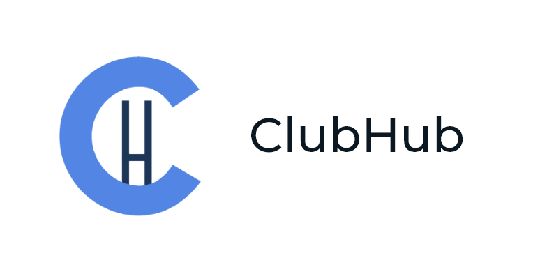

ClubHub is a mobile application designed to be the central point of communication between player and manager in any team-based sport, enabling daily team communications to be carried out in a smooth and professional manner.

## Preview


## Table of Contents
[ClubHub](#title)  
[Preview](#demo)  
[Table of Contents](#toc)  
[Installation](#installation)  
[Development](#development) 

## Installation
To use our project, first clone this repository on your machine by using the command:  

```git clone https://github.com/SeamusX7/ClubHub.git```  

Next, using npm, install all of this project's dependencies:

```npm install```

Finally, launch the application in Metro Bundler using the following command:

```npm start```

Metro Bundler will provide a QR code which can be scanned to open the application in the _Expo Go_ application available on both the App and Play Stores respectively.

## Development
_How do we develop?_  

The developers of ClubHub use a tried and tested workflow when it comes to our version control. Upon creation of our Scrum sprints, each development task is then given a GitHub Issue. Each Issue comes equipped with its own unique ID which we then use to create a branch for the development of said issue alone.  

For example, the following breakdown shows the flow of operations:
1. Task identified in sprint meeting -> ```Create login validation```
1. GitHub Issue created for task and given auto-incrementing ID -> ```196```
1. Branch created for task using the following naming convention: issueNumber_briefDescription -> ```196_create_login_validation```
